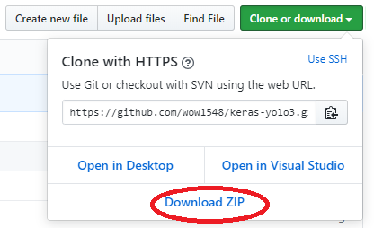

# keras-yolo3

[](LICENSE)

## Introduction

A Keras implementation of YOLOv3 (Tensorflow backend) inspired by [allanzelener/YAD2K](https://github.com/allanzelener/YAD2K).


---
※ 파이썬이 설치되어 있어야 합니다. ※

## 사용 방법
1. 위의 다운로드 버튼을 눌러서 파일을 다운로드하고 압축을 풀어주세요.




2. YOLO 웹 사이트에서 YOLOv3 weights파일을 다운받습니다. [YOLO website](https://pjreddie.com/media/files/yolov3.weights).
3. 다운받은 weights 파일을 keras-yolo3 폴더에 넣습니다.
4. keras-yolo3 폴더에서 cmd 창을 실행시키고 아래의 명령어를 입력합니다.

```
python -m pip install keras tensorflow numpy Pillow matplotlib
```
※ 위 코드에서 에러가 발생하면 파이썬 환경변수 설정이 되어있나 확인해주세요 ※

```
python convert.py yolov3.cfg yolov3.weights model_data/yolo.h5
```
5. 변환 작업이 끝나면 아래 명령어를 입력해 YOLO를 사용합니다.
```
$python yolo_video.py --image
    Using TensorFlow backend.
    Image detection mode
    Ignoring remaining command line arguments: ./path2your_video,
    ~~~
    ~~~
    ~~~
    Instructions for updating:
    Colocations handled automatically by placer.
    model_data/yolo.h5 model, anchors, and classes loaded.
    Input image filename:test/dog.jpg
``` 
                     ↑↑↑↑ test/dog.jpg 말고 다른 이미지 파일도 사용해보세요

결과


### YOLO 사용법
Use --help to see usage of yolo_video.py:
yolo_video.py 사용법
```
usage: yolo_video.py [-h] [--model ] [--anchors ANCHORS]
                     [--classes CLASSES] [--gpu_num GPU_NUM] [--image]
                     [--input] [--output]

positional arguments:
  --input        동영상 인풋 경로
  --output       동영상 아웃풋 경로

선택 인자:
  -h, --help         show this help message and exit
  --model MODEL      모델 weight 파일 경로, 기본 경로는 model_data/yolo.h5
  --anchors ANCHORS  anchor definitions 경로, 기본 경로는
                     model_data/yolo_anchors.txt
  --classes CLASSES  class definitions 경로, 기본 경로는
                     model_data/coco_classes.txt
  --gpu_num GPU_NUM  사용할 GPU의 개수, 기본 1
  --image            이미지 인식 모드, 다른 인자들을 무시합니다.
```


Tiny YOLOv3의 경우 비슷한 방법으로 모델 경로와 앵커 경로를 `--model model_file`와 `--anchors anchor_file`로 지정하면됩니다.  

다중GPU 사용방법 :`--gpu_num N `을 사용하여 N 개의 GPU를 사용합니다. 이것은 [Keras multi_gpu_model()](https://keras.io/utils/#multi_gpu_model)에 상속 됩니다.

## 학습시키기

1. 자신의 주석 파일 및 클래스 이름 파일을 생성합니다.  
    하나의 이미지에 대한 하나의 행;  
    행 형식: `image_file_path box1 box2 ... boxN`;  
    박스 형식: `x_min,y_min,x_max,y_max,class_id` (공백 없음).  
    VOC 데이터셋의 경우 `python voc_annotation.py`  
    예제:
    ```
    path/to/img1.jpg 50,100,150,200,0 30,50,200,120,3
    path/to/img2.jpg 120,300,250,600,2
    ...
    ```

2. `python convert.py -w yolov3.cfg yolov3.weights model_data / yolo_weights.h5`를 실행했는지 확인하세요.
    model_data / yolo_weights.h5 파일은 사전 가중치를 로드하는 데 사용됩니다.

3. train.py를 수정하고 학습을 시작하세요.
    `python train.py`
    yolo_video.py를 사용할 때 훈련 된 가중치 또는 체크 포인트 가중치를`--model model_file` 명령 행 옵션으로 사용하세요.
    클래스 경로 나 앵커 경로는`--classes class_file`와`--anchors anchor_file`으로 수정해야합니다.


YOLOv3에 원래의 가중치를 사용하려면 다음 방법대로 진행하세요:  
    1.`wget https : // pjreddie.com / media / files / darknet53.conv.74`  
    2. darknet53.weights로 이름을 변경하세요.  
    3.`python convert.py -w darknet53.cfg darknet53.weights model_data / darknet53_weights.h5`  
    4. train.py에서 model_data / darknet53_weights.h5를 사용하세요.  

---


## Some issues to know

1. The test environment is
    - Python 3.5.2
    - Keras 2.1.5
    - tensorflow 1.6.0

2. Default anchors are used. If you use your own anchors, probably some changes are needed.

3. The inference result is not totally the same as Darknet but the difference is small.

4. The speed is slower than Darknet. Replacing PIL with opencv may help a little.

5. Always load pretrained weights and freeze layers in the first stage of training. Or try Darknet training. It's OK if there is a mismatch warning.

6. The training strategy is for reference only. Adjust it according to your dataset and your goal. And add further strategy if needed.

7. For speeding up the training process with frozen layers train_bottleneck.py can be used. It will compute the bottleneck features of the frozen model first and then only trains the last layers. This makes training on CPU possible in a reasonable time. See [this](https://blog.keras.io/building-powerful-image-classification-models-using-very-little-data.html) for more information on bottleneck features.
